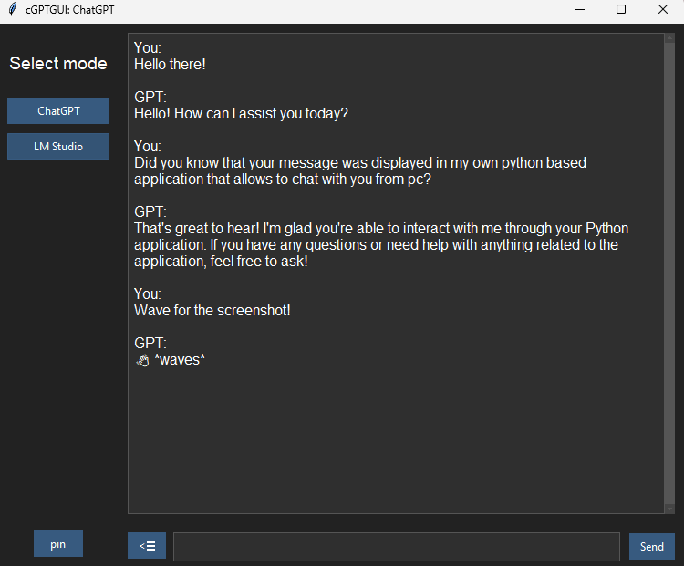

# cGPTGUI

## Description

cGPTGUI is a simple Tkinter-based GUI application that allows users to chat with either OpenAI's ChatGPT or a locally installed LM Studio client. The GUI features an intuitive chat interface and responsive design, making interactions with language models accessible and user-friendly.

## Preview



## Features

- **Multiple Modes**:
  - **ChatGPT**: Connects to OpenAI's ChatGPT using the provided API key.
  - **LM Studio**: Connects to a locally hosted LM Studio model.
- **User-Friendly Interface**:
  - Expandable and collapsible sidebar for mode selection.
  - Text input field with multiline support and adjustable height.
  - Pin window functionality to keep the chat window always on top.
- **Responsive Chatting**:
  - Instant display of user and assistant messages with formatted chat history.
  - Convenient keyboard shortcuts, including Enter for sending messages.

## Installation

1. Clone the repository:
   ```bash
   git clone https://github.com/Elrcx/cGPTGUI.git
   cd cGPTGUI
   ```

2. Install the required dependencies:
   ```bash
   pip install -r requirements.txt
   ```

3. Set up environment variables:
   - Create a `.env` file and add your OpenAI API key:
     ```
     OPENAI_API_KEY=your_openai_api_key
     LMSTUDIO_MODEL=your_model_name
     ```

4. Run the application:
   ```bash
   python main.py
   ```

## Usage

- **Mode Selection**: Choose between `ChatGPT` or `LM Studio` mode using the sidebar options.
- **Sending Messages**:
  - Type your message in the input box.
  - Press `Enter` to send the message or `Shift + Enter` to create a newline.
- **Pin Window**: Click the "pin" button to keep the window on top of other applications.
- **Toggle Sidebar**: Use the floating button on the left side to hide or reveal the sidebar.

## License

This project is licensed under the [Beerware](https://en.wikipedia.org/wiki/Beerware).
